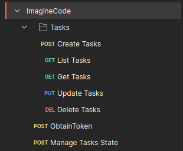

# Imagine
> ESPAÑOL

El proyecto fue creado con Django y Django Rest Framework (DRF), Se intentó usar siempre lo nativo de estos frameworks.

Para las Task se usó `ViewModel`, ya que DRF lo maneja nativo muy bien y controla todo internamente,
quizá si se necesita tener más control de los ménsaje y otras cosas pueden tomarse en consideración usar otras librerías,
por la rapidez y que pueda crecer ordenadamente.

El proyecto se émpaqueto en los pocos archivos que se manejaron, esto aplicando Clean Code,
También aplicándose concepto SOLID para tener responsabilidades separadas por más pequeñas que sean (O parezcan).

Se usó Abstracción y POO, también se íntento usar algo del desarrollo de la arquitectura hexagonal,
Digo algo por qué Django tiene su propia estructura que funciona muy bien, intentar cambiar esto no sería una buena idea,
pero aun así siguiendo SOLID, se declararon 2 carpetas `repository/` y `service/` de esa manera se tiene
responsabilidad separada y la arquitectura hexagonal todo lo hace por capas, El proyecto es fácil de entender,
está encapsulado, fácil de mantener y puede crecer sin problemas.

Para ejecutar y administrar el proyecto se créo un archivo unico bash.

```bash
imagine.sh
```

Podrá ver más detalle de este a continuación, pero con este archivo podrá hacer todo en Docker y NO debería
tener ningún problema.

## Python Version
`>3.10`

___

**Comment**
This project it was created with:

* SOLID Concept
* Abstraction
* POO
* Clean Code
___

## Documentation API
#### Imagine API (v1) (**I Recommend use the Postman Colección:**)
* First you need to start your server.
> NOTA: Exist Enums for manage the state/status Tasks: You can see them here: [See Enums](http://localhost:8000/redoc/#tag/tasks/operation/tasks_list)


**Postman Colección:** `docs/imagineDocs.postman_collection.json`


**Auto Docs by Schema swagger:** [http://localhost:8000/docs/](http://localhost:8000/docs/)


**Imagine API ReDoc:** [http://localhost:8000/redoc/](http://localhost:8000/redoc/)

Endpoints Disponibles:



___

## Docker | Run server
> You had to have installed  `docker` and `docker-compose`
>
> Docker: https://docs.docker.com/engine/install/ubuntu/
>
> Docker-compose: https://docs.docker.com/compose/install/

**Run the command**

If you need to deploy through Docker I did development a script in bash for make this easier

### Start Project

```bash
./imagine.sh runserver
```

> This command has works with permission to execute.  If this command does not work, please execute: `chmod +x imagine.sh`

This command `build`, `migrations`, and will run the `server`, if you want to development in docker environment


**Comment:**

Sometimes you need to run the command with `sudo` in that way you have to run the follows command:

```
> ./imagine.sh help

imagine.sh commands:
  runserver: run the development stack"
  test: You have to running runserver first and other terminal you run this command
  migrate: run migrate to DB"
  run: Just run de server"
  exec: run a command inside a running container
  manage.py: run a manage.py command"
```

## Run Tests

You can run the test in Docker, Like this:
* IMPORTANTE: You have to running runserver first and other terminal you run this command


```bash
./imagine.sh test
```

```bash
(venv) ➜  imagine git:(master) ./imagine.sh test
Found 21 test(s).
Creating test database for alias 'default'...
System check identified no issues (0 silenced).
.....................
----------------------------------------------------------------------
Ran 21 tests in 0.130s

OK
Destroying test database for alias 'default'...
```
___

Or You can run in the local serve like this:

```bash
python manage.py test
```


## Virtual Environment | Development
> You had to have installed `virtualenv` and `pip`

**1- Initial your virtualenv**

`virtualenv <path> --python=python3.10`

**2- Active your virtualenv**

`source <path>/bin/activate`

**3- Install Dependency**

`pip install -r requirements/base.txt`

**4- Install Migrations**

`python manage.py migrate`

**5- load User Admin and Group Users**

`python manage.py loaddata fixtures/users_admin.json`

**6- Run local server**

`python manage.py runserver`

**Comment:**

> If you connect like this, it's just for development, you will have a sqlite3 DB or you can copy file:
> imagine.env, change the name just for `.env` and put in there your credentials for postgres
___


## User Admin Default

You have to use the following credentials

| user                 | password    |
|----------------------|-------------|
| imagine@example.com  | imagine123  |

___

## Install this if you need to development
> Before you has to install Virtual Environment

### 1- How to set up dev tools
* install dev requirements  `pip install -r requirements/dev.txt`
* run  `pre-commit install`

### 2- How to set up linters tools
* install linters requirements  `pip install -r requirements/linters.txt`

### 3- How to run linters?
There are 3 types of linters:

* **Black:** Which formats the python code to black style: `black apps/`

* **Flake8:** which analyze code: `flake8 apps/`

* **Isort:** isort your imports, so you don't have to: `isort apps/ --profile black`

### 4- You can also run all linters as follows:

* `pre-commit run --all-files`

Details before run
```bash
Check Yaml...............................................................Passed
Fix End of Files.........................................................Passed
Trim Trailing Whitespace.................................................Passed
black....................................................................Passed
flake8...................................................................Passed
isort....................................................................Passed
```
